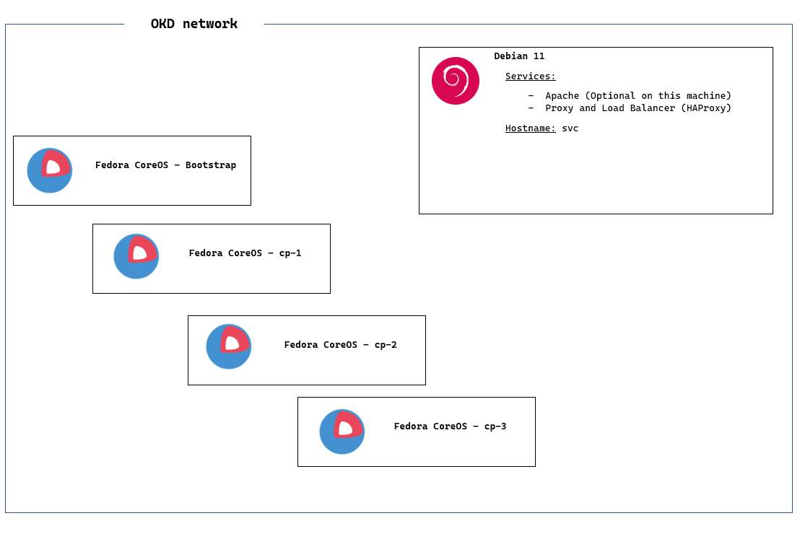

# OKD
## Overview 

- OKD is a distribution of Kubernetes optimized for continuous application development and multi-tenant deployment

- OKD embeds Kubernetes and extends it with security and other integrated concepts

- OKD adds developer and operations-centric tools on top of Kubernetes to enable rapid application development, easy deployment and scaling, and long-term lifecycle maintenance for small and large teams

- OKD is also referred to as Origin in GitHub and in the documentation

- OKD is a sibling Kubernetes distribution to Red Hat OpenShift

## Difference between OKD and OCP (Openshift Container Platform)
 The difference between OKD et OCP (Openshift Container Platform) is that OKD is a community supported and totally free to use and modify version of Kubernetes (somewhat similar to Fedora compared to RHEL in terms of being upstream of the commercial product) and it uses Fedora CoreOS as the base OS for the cluster, on the other hand, OCP (Openshift Container Platform) is a subscription-based hybrid cloud enterprise Kubernetes platform that is supported by Red Hat, and it uses Redhat CoreOS.

## OKD Bare Metal Install - User Provisioned Infrastructure (UPI)

- [OKD Bare Metal Install - User Provisioned Infrastructure (UPI)](#OKD-4-bare-metal-install---user-provisioned-infrastructure-upi)
  - [Architecture Diagram](#architecture-diagram)
  - [Requirements for a cluster with user-provisioned infrastructure](#requirements-for-a-cluster-with-user-provisioned-infrastructure)
    - [Required machines for cluster installation](#required-machines-for-cluster-installation)
    - [Minimum resource requirements for cluster installation](#minimum-resource-requirements-for-cluster-installation)
    - [Networking requirements for cluster installation](#networking-requirements-for-cluster-installation)
   - [DNS requirements](#user-provisioned-dns-requirements)
   - [Load balancing requirements](#load-balancing-requirements-for-user-provisioned-infrastructure)
   - [Files required for cluster installation](#files-to-download)
   - [Load Balancer and Proxy configuration](#configure-the-load-balancer-and-the-ingress-controller)
   - [Cluster configuration (Generate and host the install files on an web server)](#generate-and-host-install-files)
   - [Setup Static IP addresses](#static-ip-addresses)
   - [Install OKD](#install-okd)
   - [Monitor the Bootstrap Process](#monitor-the-bootstrap-process)
   - [Wait for installation to complete](#wait-for-installation-to-complete)
   - [Join the worker nodes](#join-worker-nodes)
   - [Access the OKD web console](#access-the-openshift-console)
- [Sources and References](#sources)

  
  
### Architecture Diagram

It's the same architecture as the OpenShift Container Platform, but without the RedHat subscription and without the RedHat CoreOS.



### Requirements for a cluster with user-provisioned infrastructure

   For a cluster that contains user-provisioned infrastructure, you must deploy all of the required machines.

   This section describes the requirements for deploying OKD on user-provisioned infrastructure.
#### Required machines for cluster installation

The smallest OKD clusters require the following hosts:

| Hosts | Description |
| --- | --- |
| One temporary bootstrap machine | The cluster requires the bootstrap machine to deploy the OKD cluster on the three control plane (master) machines. You can remove the bootstrap machine after you install the cluster. |
| Three control plane (master) machines | The control plane (master) machines run the Kubernetes and OKD services that form the control plane (master). |
| At least two compute machines, which are also known as worker machines. | The workloads requested by OKD users run on the compute machines. |

The bootstrap and control plane (master) machines must use Fedora CoreOS (FCOS) as the operating system. However, the compute (worker) machines can choose between Fedora CoreOS (FCOS), Fedora 8.6, Fedora 8.7, or Fedora 8.8. (We'll use Fedora CoreOS for all machines in this example).

#### Minimum resource requirements for cluster installation

The following table lists the minimum resource requirements for each machine in the cluster:
   | <p align='center'>Machine</p> | <p align='center'>CPU or vCPU <sup>[1]</sup></p> | <p align='center'>Memory</p> | <p align='center'>Storage</p> | <p align='center'>NICs</p> | <p align='center'>IOPS <sup>[2]</sup></p> |
   | --- | --- | --- | --- | --- | --- |
   | <p align='center'>Bootstrap</p> | <p align='center'>4</p> | <p align='center'>16 GB</p> | <p align='center'>100 GB</p> | <p align='center'>1</p> | <p align='center'>300</p> |
   | <p align='center'>Control plane (master)</p> | <p align='center'>4</p> | <p align='center'>16 GB</p> | <p align='center'>100 GB</p> | <p align='center'>1</p> | <p align='center'>300</p> |
   | <p align='center'>Compute (worker)</p> | <p align='center'>2</p> | <p align='center'>8 GB</p> | <p align='center'>100 GB</p> | <p align='center'>1</p> | <p align='center'>300</p> |

> 1. One vCPU is equivalent to one physical core when simultaneous multithreading (SMT), or hyperthreading, is not enabled. When enabled, use the following formula to calculate the corresponding ratio: (threads per core × cores) × sockets = vCPUs.
> 2. OKD and Kubernetes are sensitive to disk performance, and faster storage is recommended, particularly for etcd on the control plane nodes (master nodes) which require a 10 ms p99 fsync duration. Note that on many cloud platforms, storage size and IOPS scale together, so you might need to over-allocate storage volume to obtain sufficient performance.
> 3. As with all user-provisioned installations, if you choose to use Fedora compute (worker) machines in your cluster, you take responsibility for all operating system life cycle management and maintenance, including performing system updates, applying patches, and completing all other required tasks.

If an instance type for your platform meets the minimum requirements for cluster machines, it is supported to use in OKD.

#### Networking requirements for cluster installation

All the Fedora CoreOS (FCOS) machines require networking to be configured in initramfs during boot to fetch their Ignition config files.

During the initial boot, the machines require an IP address configuration that is set either through a DHCP server or statically by providing the required boot options. After a network connection is established, the machines download their Ignition config files from an HTTP or HTTPS server. The Ignition config files are then used to set the exact state of each machine. The Machine Config Operator completes more changes to the machines, such as the application of new certificates or keys, after installation.

It is recommended to use a DHCP server for long-term management of the cluster machines. Ensure that the DHCP server is configured to provide persistent IP addresses, DNS server information, and hostnames to the cluster machines.

If a DHCP service is not available for your user-provisioned infrastructure, you can instead provide the IP networking configuration and the address of the DNS server to the nodes at FCOS install time. These can be passed as boot arguments if you are installing from an ISO image.

The Kubernetes API server must be able to resolve the node names of the cluster machines. If the API servers and worker nodes are in different zones, you can configure a default DNS search zone to allow the API server to resolve the node names. Another supported approach is to always refer to hosts by their fully-qualified domain names in both the node objects and all DNS requests.

##### Network connectivity requirements

You must configure the network connectivity between machines to allow OKD cluster components to communicate. Each machine must be able to resolve the hostnames of all other machines in the cluster.

This section provides details about the ports that are required.

&#9888; **IMPORTANT**: In connected OKD environments, all nodes are required to have internet access to pull images for platform containers and provide telemetry data to Red Hat.

Ports used for all-machine to all-machine communications:

| Protocol | Port | Description |
| --- | --- | --- |
| ICMP | N/A | Network reachability checks |
| <p style="border-bottom: none;">TCP</p> | 1936 | Metrics |
|     | 9000 - 9999 | Host level services, including the node exporter on ports 9100-9101 and the Cluster Version Operator on port 9099. |
|  <p style="border-bottom: none;"></p>   | 10250 - 10259 | The default ports that Kubernetes reserves |
|     | 10256 | OpenshiftSDN |
| <p style="border-bottom: none;">UDP</p> | 4789 | VXLAN |
|  <p style="border-bottom: none;"></p>   | 6081 | Geneve |
|  <p style="border-bottom: none;"></p>   | 9000 - 9999 | Host level services, including the node exporter on ports 9100-9101. |
|  <p style="border-bottom: none;"></p>   | 500 | IPsec IKE packets |
|  <p style="border-bottom: none;"></p>   | 4500 | IPsec NAT-T packets |
| TCP/UDP | 30000 - 32767 | Kubernetes NodePort range |
| ESP | N/A | IPsec Encapsulating Security Payload (ESP) |

Ports used for all-machine to control plane (master) communications:
| Protocol | Port | Description |
| --- | --- | --- |
| TCP | 6443 | Kubernetes API server |

Ports used for control plane machine to control plane (master to master) machine communications:
| Protocol | Port | Description |
| --- | --- | --- |
| TCP | 2379 - 2380 | etcd server and peer API |

#### User-provisioned DNS requirements

In OKD deployments, DNS name resolution is required for the following components:

- The Kubernetes API
- The OKD application wildcard
- The bootstrap, control plane (master), and compute (worker) machines

Reverse DNS resolution is also required for the Kubernetes API, the bootstrap machine, the control plane (master) machines, and the compute (worker) machines.

DNS A/AAAA or CNAME records are used for name resolution and PTR records are used for reverse name resolution. The reverse records are important because Fedora CoreOS (FCOS) uses the reverse records to set the hostnames for all the nodes, unless the hostnames are provided by DHCP. Additionally, the reverse records are used to generate the certificate signing requests (CSR) that OKD needs to operate.

The following DNS records are required for a user-provisioned OKD cluster and they must be in place before installation. In each record, <cluster_name> is the cluster name and <base_domain> is the base domain that you specify in the install-config.yaml file. A complete DNS record takes the form: <component>.<cluster_name>.<base_domain>..

For example, if you specify the cluster name as okd and the base domain as osupytheas.fr, the DNS record for the Kubernetes API is api.okd.osupytheas.fr., and so on.

Required DNS and reverse DNS records:
| Component | DNS record | Description |
| --- | --- | --- |
| Kubernetes API | api.<cluster_name>.<base_domain>. | A DNS A/AAAA or CNAME record, and a DNS PTR record, to identify the API load balancer. These records must be resolvable by both clients external to the cluster and from all the nodes within the cluster. |
| | api-int.<cluster_name>.<base_domain>. | A DNS A/AAAA or CNAME record, and a DNS PTR record, to internally identify the API load balancer. These records must be resolvable from all the nodes within the cluster. <br><br> <div style="background-color: #ffdddd; color: #000000; padding: 10px; border-left: 6px solid #f44336;"> <span style="font-size: 16px; font-">&#9888; &nbsp;**IMPORTANT:**</span><br> The API server must be able to resolve the worker nodes by the hostnames that are recorded in Kubernetes. If the API server cannot resolve the node names, then proxied API calls can fail, and you cannot retrieve logs from pods.</div> |
| Routes | *.apps.<cluster_name>.<base_domain>. | A wildcard DNS A/AAAA or CNAME record that refers to the application ingress load balancer. The application ingress load balancer targets the machines that run the Ingress Controller pods. The Ingress Controller pods run on the compute (worker) machines by default. These records must be resolvable by both clients external to the cluster and from all the nodes within the cluster.<br><br><div style="padding: 10px; border: solid 1px; font-style: italic">For example, <code>console-openshift-console.apps.&lt;cluster_name&gt;.&lt;base_domain&gt;</code> is used as a wildcard route to the OKD console. </div> |
| Bootstrap machine | bootstrap.<cluster_name>.<base_domain>. | A DNS A/AAAA or CNAME record, and a DNS PTR record, to identify the bootstrap machine. These records must be resolvable by the nodes within the cluster. |
| Control plane (master) machines | cp-&lt;n&gt;.<cluster_name>.<base_domain>. | DNS A/AAAA or CNAME records and DNS PTR records to identify each machine for the control plane nodes (master nodes). These records must be resolvable by the nodes within the cluster. |
| Compute (worker) machines | worker-&lt;n&gt;.<cluster_name>.<base_domain>. | DNS A/AAAA or CNAME records and DNS PTR records to identify each machine for the worker nodes. These records must be resolvable by the nodes within the cluster. |

##### Example DNS Configuration for a User-Provided Infrastructure
In this example, the cluster name is okd and the base domain is osupytheas.fr.

- DNS Records:


   ```
   ; Temp Bootstrap Node
   bootstrap.okd.osupytheas.fr.        IN      A      <ip_address_reserved_for_bootstrap_node_in_dhcp> or <ip_address_we_will_setup_on_machines_on_boot>

   ; Control Plane Nodes (Master Nodes)
   cp-1.okd.osupytheas.fr.         IN      A      <ip_address_reserved_for_master_node_1_in_dhcp> or <ip_address_we_will_setup_on_machines_on_boot>
   cp-2.okd.osupytheas.fr.         IN      A      <ip_address_reserved_for_master_node_2_in_dhcp> or <ip_address_we_will_setup_on_machines_on_boot>
   cp-3.okd.osupytheas.fr.         IN      A      <ip_address_reserved_for_master_node_3_in_dhcp> or <ip_address_we_will_setup_on_machines_on_boot>

   ; Worker Nodes
   worker-1.okd.osupytheas.fr.     IN      A      <ip_address_reserved_for_worker_node_1_in_dhcp> or <ip_address_we_will_setup_on_machines_on_boot>
   worker-2.okd.osupytheas.fr.     IN      A      <ip_address_reserved_for_worker_node_2_in_dhcp> or <ip_address_we_will_setup_on_machines_on_boot>

   ; OKD Internal - Load balancer
   api.okd.osupytheas.fr.        IN    A    <the_static_ip_address_we_setup>
   api-int.okd.osupytheas.fr.    IN    A    <the_static_ip_address_we_setup>
   *.apps.okd.osupytheas.fr.     IN    A    <the_static_ip_address_we_setup>
   proxy.okd.osupytheas.fr.     IN     A     <the_static_ip_address_we_want_to_setup>  ;; Optional, if not specified, must set a static IP for the proxy machine.

   ; ETCD Cluster
   etcd-0.okd.osupytheas.fr.    IN    A     <ip_address_reserved_for_master_node_1_in_dhcp> or <ip_address_we_will_setup_on_machines_on_boot>
   etcd-1.okd.osupytheas.fr.    IN    A     <ip_address_reserved_for_master_node_2_in_dhcp> or <ip_address_we_will_setup_on_machines_on_boot>
   etcd-2.okd.osupytheas.fr.    IN    A     <ip_address_reserved_for_master_node_3_in_dhcp> or <ip_address_we_will_setup_on_machines_on_boot>

   ; OKD Internal SRV records
   _etcd-server-ssl._tcp.okd.osupytheas.fr.    86400     IN    SRV     0    10    2380    etcd-0.okd
   _etcd-server-ssl._tcp.okd.osupytheas.fr.    86400     IN    SRV     0    10    2380    etcd-1.okd
   _etcd-server-ssl._tcp.okd.osupytheas.fr.    86400     IN    SRV     0    10    2380    etcd-2.okd

   ; OKD Internal - Wildcard Routes
   oauth-openshift.apps.okd.osupytheas.fr.     IN     A     <the_static_ip_address_we_setup>
      
   ; OKD Internal - Console
   console-openshift-console.apps.okd.osupytheas.fr.     IN     A     <the_static_ip_address_we_setup>
   ```

- Reverse DNS Records:

   ```
   ; OKD Internal - Load balancer
   <the_static_ip_address_we_setup_reversed>      IN    PTR    proxy.okd.osupytheas.fr. ;; Optional, if not specified, must set a static IP for the proxy machine.
   <the_static_ip_address_we_setup_reversed>      IN    PTR    api.okd.osupytheas.fr.
   <the_static_ip_address_we_setup_reversed>      IN    PTR    api-int.okd.osupytheas.fr.
   ;
   ; Temp Bootstrap Node
   <ip_address_reserved_for_bootstrap_node_in_dhcp_reversed> or <ip_address_we_will_setup_on_machines_on_boot_reversed>    IN    PTR    bootstrap.okd.osupytheas.fr.
   ;
   ; Control Plane Nodes (Master Nodes)
   <ip_address_reserved_for_master_node_1_in_dhcp_reversed> or <ip_address_we_will_setup_on_machines_on_boot_reversed>    IN    PTR    cp-1.okd.osupytheas.fr.
   <ip_address_reserved_for_master_node_2_in_dhcp_reversed> or <ip_address_we_will_setup_on_machines_on_boot_reversed>    IN    PTR    cp-2.okd.osupytheas.fr.
   <ip_address_reserved_for_master_node_3_in_dhcp_reversed> or <ip_address_we_will_setup_on_machines_on_boot_reversed>    IN    PTR    cp-3.okd.osupytheas.fr.
   ;
   ; Worker Nodes
   <ip_address_reserved_for_worker_node_1_in_dhcp_reversed> or <ip_address_we_will_setup_on_machines_on_boot_reversed>    IN    PTR    worker-1.okd.osupytheas.fr.
   <ip_address_reserved_for_worker_node_2_in_dhcp_reversed> or <ip_address_we_will_setup_on_machines_on_boot_reversed>    IN    PTR    worker-2.okd.osupytheas.fr.
   ```

> **Note:**
>
> A PTR record is not required for the OKD application wildcard.


#### Load balancing requirements for user-provisioned infrastructure

Before you install OKD, you must provision the API and application Ingress load balancing infrastructure. In production scenarios, you can deploy the API and application Ingress load balancers separately so that you can scale the load balancer infrastructure for each in isolation.

The load balancer infrastructure must meet the following requirements:

1. **API load balancer**: Provides a common endpoint for users, both human and machine, to interact with and configure the platform. Configure the following conditions:
   - Layer 4 load balancing only. This can be referred to as Raw TCP, SSL Passthrough, or SSL Bridge mode. If you use SSL Bridge mode, you must enable Server Name Indication (SNI) for the API routes.
   - A stateless load balancing algorithm. The options vary based on the load balancer implementation.

   Configure the following ports on both the front and back of the load balancers:
   
   API load balancer:
   | Port | Back-end machines (pool members) | Internal | External | Description |
   | ---- | -------------------------------- | -------- | -------- | ----------- |
   | 6443 | Bootstrap and control plane (master). You remove the bootstrap machine from the load balancer after the bootstrap machine initializes the cluster control plane (master). You must configure the /readyz endpoint for the API server health check probe. | <p align="center">✅</p> | <p align="center">✅</p> | Kubernetes API server |
   | 22623 | Bootstrap and control plane (master). You remove the bootstrap machine from the load balancer after the bootstrap machine initializes the cluster control plane (master). | <p align="center">✅</p> | <p align="center"></p> | Machine config server |

2. **Application Ingress load balancer**: Provides an ingress point for application traffic flowing in from outside the cluster. A working configuration for the Ingress router is required for an OKD cluster.

   Configure the following conditions:
   - Layer 4 load balancing only. This can be referred to as Raw TCP, SSL Passthrough, or SSL Bridge mode. If you use SSL Bridge mode, you must enable Server Name Indication (SNI) for the ingress routes.
   - A connection-based or session-based persistence is recommended, based on the options available and types of applications that will be hosted on the platform.

> **Tip:**
>
>  If the true IP address of the client can be seen by the application Ingress load balancer, enabling source IP-based session persistence can improve performance for applications that use end-to-end TLS encryption.

   Configure the following ports on both the front and back of the load balancers:
   
   Application Ingress load balancer:
   | Port | Back-end machines (pool members) | Internal | External | Description |
   | ---- | -------------------------------- | -------- | -------- | ----------- |
   | 443 | The machines that run the Ingress Controller pods, compute, or worker, by default. | <p align="center">✅</p> | <p align="center">✅</p> | HTTPS traffic |
   | 80 | The machines that run the Ingress Controller pods, compute, or worker, by default. | <p align="center">✅</p> | <p align="center">✅</p> | HTTP traffic |


### Files to download

1. Download any Linux based OS you want, this will server as the load balancer and the ingress controller (proxy machine)

   -  In this example, we'll go with Debian 12 iso.
   -  You can download it via the official website: https://www.debian.org/distrib/netinst
   -  For quick download, you can [click here to download debian 12.0.0-amd64-netinst](https://cdimage.debian.org/debian-cd/current/amd64/iso-cd/debian-12.0.0-amd64-netinst.iso), because that's what we'll be working with.

2. For the pull secret, it's not mandatory to use the one from RedHat, you can use this one instead:

   ```json
   {
      "auths":{
         "fake":{
            "auth":"aWQ6cGFzcwo="
         }
      }
   }
   ```
      Copy it to a file on local machine.

   > This ```{"auths":{"fake":{"auth":"aWQ6cGFzcwo="}}}``` to copy-paste easily.

   > You can use the one from RedHat if you want, but you'll need to create an account on their website, and you'll need to have a valid subscription to continue using the cluster after the 60 days trial.
   > You have to download the pull secret from the [RedHat OpenShift Cluster Manager](https://cloud.redhat.com/openshift)
   > -  Select 'Create Cluster' from the 'Clusters' navigation menu
   > -  Select 'RedHat OpenShift Container Platform'
   > -  Select 'Run on Bare Metal'
   > -  Download Pull secret
   > -  Copy the pull secret to a file on the proxy machine
   >
   > 
   > **Note:**
   >
   > If you do not use the pull secret from the Red Hat OpenShift Cluster Manager:
   > - Red Hat Operators are not available.
   > - The Telemetry and Insights operators do not send data to Red Hat.
   > - Content from the Red Hat Ecosystem Catalog Container images registry, such as image streams and Operators, are not available.


3. Download the installation program named [```openshift-install-linux.tar.gz```](https://github.com/okd-project/okd/releases/download/4.12.0-0.okd-2023-02-18-033438/openshift-install-linux-4.12.0-0.okd-2023-02-18-033438.tar.gz) from [the OKD Github Repository](https://github.com/okd-project/okd/releases)

4. Download the Fedora CoreOS image (.iso and .raw.xz) from [the Fedora CoreOS Official Website](https://getfedora.org/en/coreos/download)

5. If you want to use static IP addresses, write down all IP addresses of all machines.
   > If you want to use DHCP, write down all MAC addresses of all machines.


### Configure the load balancer and the ingress controller

1. Install the OS that you chose on the services machine, in our case it will be debian 12.

2. Boot the machine

3. Rename the openshift-install file to ```openshift-install-linux.tar.gz```
   - Sur linux, you can use the command ```mv <old_name> <new_name>```
      ```bash
      mv <current_name> openshift-install-linux.tar.gz
      ```
   - Sur windows, you can use the command ```ren <old_name> <new_name>```
      ```bash
      ren <current_name> openshift-install-linux.tar.gz
      ```
      Or you can rename it manually.
<br><br>


3. Move the ```openshift-install-linux.tar.gz``` file to it, in addition of the pull secret file:
   > `<IP_ADDRESS>` is the IP address of the proxy machine
   ```bash
   scp ~/Downloads/<openshift-install_tar.gz_file_name> ~/Downloads/pull-secret.txt  root@<IP_ADDRESS>:/root/
   ```
5. SSH to the machine

   ```bash
   ssh root@<IP_ADDRESS>
   ```
6. Navigate to https://mirror.openshift.com/pub/openshift-v4/clients/oc/latest/ and choose the folder for your operating system and architecture, and download ```oc.tar.gz```.

   Unpack the archive:
   
   ```bash
   tar xvf oc.tar.gz
   ```
   Place the ```oc``` binary in a directory that is on your ```PATH```.
   
   ```bash
   echo $PATH
   mv oc kubectl /usr/local/bin
   ```
   
   Confirm Client Tools are working

   ```bash
   kubectl version
   oc version
   ```
   
7. Extract the OpenShift Installer

   ```bash
   tar xvf openshift-install-linux.tar.gz
   ```

8. Update the OS so we get the latest packages for each of the services we are about to install

   ```bash
   apt-get update && apt-get upgrade -y
   ```
   
9. Install Git
   
   ```bash
   apt-get install git -y
   ```
   
10. Download [config files](https://github.com/Younest9/okd) for each of the steps we are about to do (```haproxy.cfg```, ```install-config.yaml```)

      ```bash
      git clone https://gitlab.osupytheas.fr/yelarjouni/okd.git
      ```
      Change the preferred editor to "```nano```" (optional)

      ```bash
      export OC_EDITOR="nano"
      export KUBE_EDITOR="nano"
      ```

11. Set a Static IP for the network interface :
   
      The ```/etc/network/interfaces``` file contains network interface configuration information for Debian Linux. Hence, edit the file:
   
      ```bash
      nano /etc/network/interfaces
      ```
   
      Look for the primary network interface in the file:
   
      - Example: ```enp0s5```
        
        ```bash
        allow-hotplug enp0s5
        iface enp0s5 inet dhcp
        ```
         Remove dhcp and allow-hotplug lines. Append the following configuration to set up/add new static IP on Debian Linux 10/11. Here is a sample config file:
      
         ```bash
         # The loopback network interface
         auto lo
         iface lo inet loopback

         # The primary network interface
         auto enp0s5
         iface enp0s5  inet static
            address 192.168.2.236
            netmask 255.255.255.0
            gateway 192.168.2.254
         ```
      Save and close the file in ```nano```. Restart the networking service:
         
      ```bash
      systemctl restart networking
      ```
12. If not using DHCP, see the [Static IP addressing](#static-ip-addressing) section for details about configuring static IP addresses for your cluster nodes later in the installation process, for now, skip to the [Install & configure Apache Web Server](#install--configure-apache-web-server) section, otherwise, continue to the next step.

13. Configure the DHCP (If you are using DHCP to provide the IP networking configuration to your cluster nodes, configure your DHCP service)

       - Add persistent IP addresses for the nodes to your DHCP server configuration. In your configuration, match the MAC address of the relevant network interface to the intended IP address for each node.

       - When you use DHCP to configure IP addressing for the cluster machines, the machines also obtain the DNS server information through DHCP. Define the persistent DNS server address that is used by the cluster nodes through your DHCP server configuration.
       
       - Define the hostnames of your cluster nodes in your DHCP server configuration. See the Setting the cluster node hostnames through DHCP section for details about hostname considerations.

#### Install & configure Apache Web Server
> Necessary to download the config files to passe in as arguments in the installation command
  
  - You can install ```apache``` on any Linux distro, in our case (Debian 12), we will use ```apt``` to install it:
     ```
     apt install apache2 -y
     ```
   - Start the service:
     ```
     systemctl start apache2
     ```
   - Enable the service:
     ```
     systemctl enable apache2
     ```
   
      > If you are installing ```apache``` on the proxy machine, you need to change the port of the service to 8080, because the load balancer will be listening on port 80.
      > To do so, edit the file ```/etc/apache2/ports.conf``` and change the port from 80 to 8080.
      > Or you can just execute the following command:
      > ```
      > sed -i 's/80/8080/g' /etc/apache2/ports.conf
      > ```
      > Then restart the service:
      > ```
      > systemctl restart apache2
      > ```

### Generate and host install files

1. Generate an SSH key pair keeping all default options

   ```bash
   ssh-keygen -t rsa
   ```

2. Create an install directory

   ```bash
   mkdir ~/okd-install
   ```

3. Copy the ```install-config.yaml``` included in the clone repository to the install directory

   ```bash
   cp ~/okd/install-config.yaml ~/okd-install
   ```
   
4. Update the ```install-config.yaml``` with your own ```pull-secret``` and ```ssh key```.
   - Line 2 should contain your base domain
   - Line 10 should contain the number of control plane nodes (master nodes) you want (default is 3)
   - Line 12 should contain the cluster name
   - Line 17 should contain the network type (```OpenShiftSDN``` (less features but more reliable) or ```OVNKubernetes```( more features but less reliable))
   - Line 23 should contain the contents of your ```pull-secret.txt```
   - Line 24 should contain the contents of your '```~/.ssh/id_rsa.pub```'

      ```bash
      nano ~/okd-install/install-config.yaml
      ```
5. Generate Kubernetes manifest files

   ```bash
   ~/openshift-install create manifests --dir ~/okd-install
   ```

6. Disable the scheduler on the control plane nodes (masetr nodes) (recommended)

   ```bash
   sed -i 's/mastersSchedulable: true/mastersSchedulable: false/' ~/okd-install/manifests/cluster-scheduler-02-config.yml
   ```
   > A warning is shown about making the control plane nodes (master nodes) schedulable. It is up to you if you want to run workloads on the Control Plane nodes (master nodes).
   >
   > If you want to, you can enable it (not recommended) with:
   > ```bash
   > sed -i 's/mastersSchedulable: false/mastersSchedulable: true/' ~/okd-install/manifests/cluster-scheduler-02-config.yml
   > ```
   > Make any other custom changes you like to the core Kubernetes manifest files.
   > If you enable the masters, you can add them to the http and https ingress in the ```haproxy.cfg``` file by uncommenting the corresponding lines (lines 86, 87, 88 and 100, 101, 102) in the haproxy.cfg file.

7. Generate the Ignition config and Kubernetes auth files

   ```bash
   ~/openshift-install create ignition-configs --dir ~/okd-install/
   ```
   
6. Create a hosting directory to serve the configuration files for the OKD booting process where the web server will be hosted

   ```bash
   mkdir /var/www/html/okd
   ```

7. Copy all generated install files and the raw.xz image to that directory

   ```bash
   cp  ~/okd-install/*  /var/www/html/okd/
   ```
8. Copy the raw.xz image to the web server directory (rename it to ```fcos``` to shorten the file name) becasue we will be typing it in the installation command later (the shorter the better):

   ```bash
   cp  ~/okd/fedora-coreos-<whatever_version_you_downloaded>.raw.xz  /var/www/html/okd/fcos
   ```
   > Example name: fedora-coreos-38.20230514.3.0-live.x86_64.raw.xz 
9. Change permissions of the web server directory

   ```bash
   chmod +r /var/www/html/okd/*
   ```
   
10. Confirm you can see all files added to the `/var/www/html/okd/` dir through ```Apache```

      ```bash
      curl localhost/okd/
      ```
      > Note: If you are on the same machine as the ```haproxy``` server, you can use the following command to test the web server:
      > ```bash
      > curl localhost:8080/okd/
      > ```

### Deploy OKD


#### Static IP addresses

   - If you are not using a DHCP service:
   
      - You must provide the IP networking configuration and the address of the DNS server to the nodes at FCOS install time (see below). These can be passed as boot arguments if you are installing from an ISO image.
      - You can set a static ip address by editing the network configuartion while live booting the machine.
         ```bash	
         sudo nmtui-edit
         ```
         > On the nmtui screen, select the interface you want to edit, then select the IPv4 configuration and change it to manual, then add the IP Address with the CIDR, the gateway address and the DNS server address. Then save and quit.
         > Restart the network service:
         > ```bash
         > sudo systemctl restart NetworkManager
         > ```
         > Then check by running:
         > ```bash
         > ip a
         > ```
      - You pass the networking configuration to the nodes by adding the flag ```--copy-network``` to the install command (see below).

#### Install OKD

Power on the bootstrap host and cp-# hosts, and boot up to the live ISO.

- If you are using static ip addresses, [change the network configuration to match your DNS records and IP addresses](#static-ip-addresses), then you have to pass ```--copy-network``` to the coreos-installer command to copy the network configuration from the live environment to the installed system.

   Use the following command then just reboot after it finishes and make sure you remove the attached .iso
   ```bash
   # Bootstrap Node - bootstrap
   sudo coreos-installer install /dev/sda -I http://<Host_apache_server>/okd/bootstrap.ign -u http:// <Host_apache_server>/okd/fcos --insecure --insecure-ignition --copy-network
   ```
   ```bash
   # Each of the Control Plane Nodes (Master Nodes) - cp-\#
   sudo coreos-installer install /dev/sda -I http://<Host_apache_server>/okd/master.ign -u http://><Host_apache_server>/okd/fcos --insecure --insecure-ignition --copy-network
   ```

- If you are using DHCP, you can just use the following commands to install OKD.
  
  Use the following command then just reboot after it finishes and make sure you remove the attached .iso
   ```bash
   # Bootstrap Node - bootstrap
   sudo coreos-installer install /dev/sda -I http://<Host_apache_server>/okd/bootstrap.ign -u http://<Host_apache_server>/okd/fcos --insecure --insecure-ignition
   ```
   ```bash
   # Each of the Control Plane Nodes (Master Nodes) - cp-\#
   sudo coreos-installer install /dev/sda -I http://<Host_apache_server>/okd/master.ign -u http://<Host_apache_server>/okd/fcos --insecure --insecure-ignition
   ```

### Monitor the Bootstrap Process

You can monitor the bootstrap process from the proxy machine at different log levels (debug, error, info)

   ```bash
   ~/openshift-install --dir ~/okd-install wait-for bootstrap-complete --log-level=debug
   ```

Once bootstrapping is complete the bootstrap node [can be removed](#remove-the-bootstrap-node)

### Remove the Bootstrap Node

Remove all references to the `bootstrap` host from the `/etc/haproxy/haproxy.cfg` file on the proxy machine

   ```bash
   # Two entries
   nano /etc/haproxy/haproxy.cfg
   # Restart HAProxy - If you are still watching HAProxy stats console you will see that the bootstrap host has been removed from the backends.
   systemctl reload haproxy
   ```

The bootstrap host can now be safely shutdown and deleted, the host is no longer required

### Wait for installation to complete

> **IMPORTANT:** if you set mastersSchedulable to false the [worker nodes will need to be joined to the cluster](#join-worker-nodes) to complete the installation. This is because the OKD Router will need to be scheduled on the worker nodes and it is a dependency for cluster operators such as ingress, console and authentication.

Collect the OpenShift Console address and kubeadmin credentials from the output of the install-complete event

   ```bash
   ~/openshift-install --dir ~/okd-install wait-for install-complete
   ```
Continue to [join the worker nodes to the cluster](#join-worker-nodes) in a new tab whilst waiting for the above command to complete

### Join Worker Nodes

#### On the worker nodes

Power on the worker hosts and boot up to the live ISO.
   
   After booting up, use the following command then just reboot after it finishes and make sure youremove the attached .iso, but before that you have to [change the network configuration to matchyour DNS records and IP addresses](#static-ip-addresses) if you are using static ip addresses.
   > `--copy-network` is only required if you are using static ip addresses.
   ```bash
   # Each of the Worker Nodes - worker-\#
   sudo coreos-installer install /dev/sda -I http://<Host_apache_server>/okd/worker.ign --insecure--insecure-ignition --copy-network
   ```
   > If you are using DHCP, you can just use the following commands to install OKD.
   > ```bash
   > # Each of the Worker Nodes - worker-\#
   > sudo coreos-installer install /dev/sda -I http://<Host_apache_server>/okd/worker.ign --insecure --insecure-ignition
   > ```

#### On the proxy machine

Setup 'oc' and 'kubectl' clients on the proxy machine for now

   ```bash
   export KUBECONFIG=~/okd-install/auth/kubeconfig
   # Test auth by viewing cluster nodes
   oc get nodes
   ```

View and approve pending CSRs

   > **Note:** Once you approve the first set of CSRs additional 'kubelet-serving' CSRs will be created. These must be approved too.
   >
   > If you do not see pending requests wait until you do.

   ```bash
   # View CSRs
   oc get csr
   # Approve all pending CSRs
   oc get csr -o go-template='{{range .items}}{{if not .status}}{{.metadata.name}}{{"\n"}}{{end}}{{end}}' | xargs oc adm certificate approve
   # Wait for kubelet-serving CSRs and approve them too with the same command
   oc get csr -o go-template='{{range .items}}{{if not .status}}{{.metadata.name}}{{"\n"}}{{end}}{{end}}' | xargs oc adm certificate approve
   ```

Watch and wait for the Worker Nodes to join the cluster and enter a 'Ready' status

   > This can take 5-10 minutes

   ```bash
   watch -n5 oc get nodes
   ```

### Access the OpenShift Console

Wait for the 'Console' Cluster Operator to become available

   ```bash
   oc get co
   ```
   
Navigate to the OpenShift Console URL (``https://console-openshift-console.apps.<Cluster_name>.<Base_domain>``) and log in as the 'kubeadmin' user

   > You will get self signed certificate warnings that you can ignore
   >
   > If you need to login as kubeadmin and need to the password again you can retrieve it with: `cat ~/okd-install/auth/kubeadmin-password`

#### Sources

- [OKD 4.3 Architecture](https://docs.okd.io/latest/architecture/architecture.html)
- [OKD 4.3 Installation Guide](https://docs.okd.io/latest/installing/installing_bare_metal/installing-bare-metal.html)
- [OKD 4.3 Bare Metal UPI](https://docs.okd.io/latest/installing/installing_bare_metal/installing-bare-metal-network-customizations.html)
- [OKD 4.3 Bare Metal UPI - Advanced Networking](https://docs.okd.io/latest/installing/installing_bare_metal/installing-bare-metal-network-customizations.html#installation-user-infra-machines-static-network_installing-bare-metal-network-customizations)
- [OKD 4.3 Bare Metal UPI - Advanced Networking - Configuring DHCP](https://docs.okd.io/latest/installing/installing_bare_metal/installing-bare-metal-network-customizations.html#installation-user-infra-machines-static-network-dhcp_installing-bare-metal-network-customizations)
- [OKD 4.3 Bare Metal UPI - Advanced Networking - Configuring DNS](https://docs.okd.io/latest/installing/installing_bare_metal/installing-bare-metal-network-customizations.html#installation-user-infra-machines-static-network-dns_installing-bare-metal-network-customizations)
- [OKD 4.3 Bare Metal UPI - Advanced Networking - Configuring Load Balancing](https://docs.okd.io/latest/installing/installing_bare_metal/installing-bare-metal-network-customizations.html#installation-user-infra-machines-static-network-load-balancing_installing-bare-metal-network-customizations)
- [OKD 4.3 Bare Metal UPI - Advanced Networking - Configuring Static IP Addresses](https://docs.okd.io/latest/installing/installing_bare_metal/installing-bare-metal-network-customizations.html#installation-user-infra-machines-static-network-static_installing-bare-metal-network-customizations)
- [OKD 4.3 Bare Metal UPI - Advanced Networking - Configuring a Firewall](https://docs.okd.io/latest/installing/installing_bare_metal/installing-bare-metal-network-customizations.html#installation-user-infra-machines-static-network-firewall_installing-bare-metal-network-customizations)
- [GitHub repository - ryanhay/ocp4-metal-install](https://github.com/ryanhay/ocp4-metal-install)
- [OKD 4.3 Bare Metal UPI - Configuring SCC](https://docs.okd.io/latest/authentication/managing-security-context-constraints.html)
- [OKD 4.3 Bare Metal UPI - Security](https://docs.okd.io/latest/security/)
